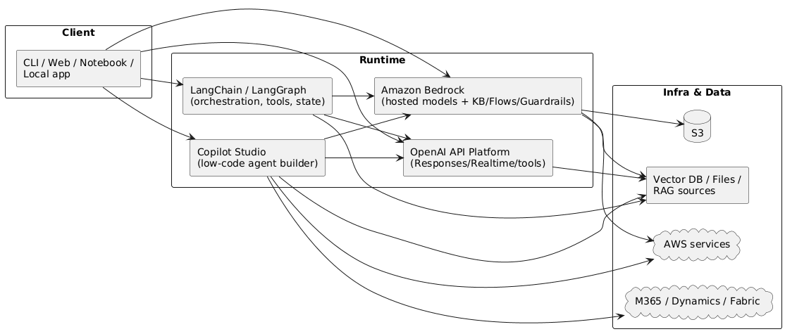

Here’s a **tech-focused, individual-dev** comparison of **Microsoft Copilot Studio**, **LangChain (and LangGraph)**, **Amazon Bedrock**, and **OpenAI’s API platform**.

---

# Where each one sits in the stack (for a solo dev)

---

# Technical comparison (for experimentation)

| Aspect                   | **Microsoft Copilot Studio**                                                                                                                             | **LangChain / LangGraph**                                                                                                                                         | **Amazon Bedrock**                                                                                                       | **OpenAI API Platform**                                                                                                                            |
| ------------------------ | -------------------------------------------------------------------------------------------------------------------------------------------------------- | ----------------------------------------------------------------------------------------------------------------------------------------------------------------- | ------------------------------------------------------------------------------------------------------------------------ | -------------------------------------------------------------------------------------------------------------------------------------------------- |
| **Core purpose**         | Low-code **agent builder** with connectors, skills/actions, prompt grounding; hosts your copilot and monitors it.                                        | **Open-source orchestration** & agent runtime. LangChain = components & LCEL; **LangGraph** = graph/state machines for controllable agents.                       | **Managed foundation-model hub** on AWS with agents, **Knowledge Bases (RAG)**, **Guardrails**, **Flows** orchestration. | **High-level LLM runtime** with **Responses API** (tool use, file/search/computer use), **Realtime API** (speech/vision streaming).                |
| **Model access**         | Through Azure OpenAI + Microsoft stack; can also call 3rd-party via connectors.                                                                          | Provider-agnostic (OpenAI, Bedrock, Azure, local); you pick embeddings, vector stores, tools.                                                                     | Dozens of models (Anthropic, Cohere, Llama, Titan, etc.) and managed eval/ops.                                           | GPT-4o family (text/vision/audio), tool calling, structured outputs, function/tool execution.                                                      |
| **Agent / tool use**     | **Prompt actions** & **connectors**; **computer use** (UI automation) for apps with no APIs; **multi-agent orchestration** (A2A). ([Microsoft Learn][1]) | LangChain tools + **LCEL** pipelines; **LangGraph** for stateful, branching, long-running agents; v1.0 emphasizes production agent runtime. ([LangChain Blog][2]) | **Agents**, **Guardrails**, **Knowledge Bases**, **Flows** (visual workflow builder + APIs). ([AWS Documentation][3])    | **Responses API** unifies chat/assistants, adds built-in tools (web/file/computer use). **Realtime API** for low-latency multimodal. ([OpenAI][4]) |
| **RAG / data grounding** | Built-in **connectors** to M365, Dynamics, Fabric + non-MS sources; grounding across multiple data sources. ([Microsoft Learn][5])                       | You assemble: loaders → text splitters → embeddings → vector DB; fully customizable.                                                                              | **Knowledge Bases** provide managed RAG over your S3/Databases with retrieval & citations. ([AWS Documentation][6])      | BYO RAG (embeddings, vector DB) or use file search tools; flexibility with your own infra. ([OpenAI][4])                                           |
| **Safety & policy**      | Enterprise guardrails, DLP, governance via Microsoft ecosystem. (See Copilot Studio blog/policies.) ([Microsoft][7])                                     | You build moderate/guardrail layers yourself or integrate 3rd-party; great control, more work.                                                                    | **Bedrock Guardrails** apply to prompts, agent I/O, and KB calls; account-level configs. ([AWS Documentation][8])        | System/message moderation options plus structured tool execution; you implement most higher-level policy. ([OpenAI][4])                            |
| **Orchestration UX**     | Visual designer + low-code + telemetry/analytics for agents. ([Microsoft][9])                                                                            | Code-first; **LCEL** for pipelines; **LangGraph** for DAG/graph control, retries, checkpoints. ([Milvus][10])                                                     | **Bedrock Flows**: visual + API workflows across models, agents, Lambda, Lex, S3. ([Amazon Web Services, Inc.][11])      | API-first; Responses is stateful and simplified; Realtime gives streaming/voice. ([OpenAI][4])                                                     |
| **Hosting & ops**        | Microsoft-hosted; easy if you’re already in M365/Azure/Fabric.                                                                                           | You host (local, cloud, serverless). Ops burden is yours.                                                                                                         | AWS-hosted; integrates with IAM, CloudWatch, S3, Lambda, etc.                                                            | OpenAI-hosted inference; you host the app and any RAG stores.                                                                                      |
| **Ecosystem lock-in**    | Tight with Microsoft stack; great if you live there.                                                                                                     | Minimal; swap models/tools freely.                                                                                                                                | Tight with AWS; great if you live there.                                                                                 | Locked to OpenAI models, but very productive and feature-rich for prototyping.                                                                     |
| **Best for a solo dev**  | Quickly standing up **enterprise-ish agents** with UI automation and M365 data.                                                                          | **Maximum control** over chains/agents; research & custom tooling; reproducibility.                                                                               | **Managed multi-model + RAG/guardrails/flows** if you want AWS to run the heavy bits.                                    | **Fastest path to working prototypes** with strong multimodal + tool use & realtime voice. ([OpenAI][12])                                          |

---

## Brief recommendations (individual dev, technical/architectural)

* **Fastest prototyping:** Use **OpenAI Responses API** for a minimal backend with robust tool use; add **Realtime API** if you want voice/vision interactivity. Later, slot in your own RAG store. ([OpenAI][4])
* **When you need controllable, stateful agents** (branches, retries, long-running, graphs): build with **LangGraph** (within LangChain), because its explicit graph/state pattern is easier to reason about and test in production than ad-hoc loops. ([LangChain Blog][2])
* **If you want “batteries-included” managed RAG/guardrails/workflows** without maintaining orchestration code: **Amazon Bedrock** with **Knowledge Bases + Guardrails + Flows** is pragmatic—especially if your data already sits on S3 and you use Lambda. ([AWS Documentation][6])
* **If your data and identity live in Microsoft 365/Dynamics/Fabric** or you want UI automation for systems without APIs, **Copilot Studio** gives you low-code agents, connectors, **computer-use**, and multi-agent orchestration. It’s the easiest way to “wire up” enterprise data sources solo. ([The Verge][13])

> Note: Bedrock’s multi-model marketplace advantage can shift over time (e.g., vendor relationships can change). Always verify current model availability if that’s a deciding factor. ([Amazon Web Services, Inc.][11])

---

### Want a tiny decision tree?

* **Need voice/vision + tool use now?** → **OpenAI (Responses + Realtime)**. ([OpenAI][4])
* **Need explicit graphs/stateful agents / long-running tasks?** → **LangGraph** (can call OpenAI or Bedrock under the hood). ([LangChain Blog][2])
* **Want managed RAG + guardrails + visual flows with AWS services?** → **Bedrock**. ([AWS Documentation][6])
* **Living in M365/Dynamics and want low-code agents & UI automation?** → **Copilot Studio**. ([Microsoft Learn][5])

---

If you share a quick **hello-world goal** (e.g., “a voice assistant that searches my PDFs and books flights”), I’ll sketch the **exact minimal architecture + sample code** for your chosen path.

[1]: https://learn.microsoft.com/en-us/ai-builder/use-a-custom-prompt-in-mcs?utm_source=chatgpt.com "Use your prompt actions in Microsoft Copilot Studio"
[2]: https://blog.langchain.com/langchain-langgraph-1dot0/?utm_source=chatgpt.com "LangChain and LangGraph Agent Frameworks Reach v1.0 ..."
[3]: https://docs.aws.amazon.com/bedrock/latest/userguide/guardrails-use.html?utm_source=chatgpt.com "Use cases for Amazon Bedrock Guardrails"
[4]: https://openai.com/index/new-tools-and-features-in-the-responses-api/?utm_source=chatgpt.com "New tools and features in the Responses API"
[5]: https://learn.microsoft.com/en-us/microsoft-copilot-studio/copilot-connectors-in-copilot-studio?utm_source=chatgpt.com "Extend the capabilities of your agent - Microsoft Copilot ..."
[6]: https://docs.aws.amazon.com/bedrock/latest/userguide/knowledge-base.html?utm_source=chatgpt.com "Retrieve data and generate AI responses with ..."
[7]: https://www.microsoft.com/en-us/microsoft-copilot/blog/copilot-studio/whats-new-in-copilot-studio-september-2025/?utm_source=chatgpt.com "What's new in Copilot Studio: September 2025"
[8]: https://docs.aws.amazon.com/bedrock/latest/userguide/guardrails-how.html?utm_source=chatgpt.com "How Amazon Bedrock Guardrails works"
[9]: https://www.microsoft.com/en-us/microsoft-copilot/blog/copilot-studio/whats-new-in-copilot-studio-june-2025/?utm_source=chatgpt.com "What's new in Copilot Studio: June 2025"
[10]: https://milvus.io/blog/langchain-vs-langgraph.md?utm_source=chatgpt.com "LangChain vs LangGraph: A Developer's Guide to ..."
[11]: https://aws.amazon.com/bedrock/pricing/?utm_source=chatgpt.com "Amazon Bedrock pricing"
[12]: https://openai.com/index/introducing-the-realtime-api/?utm_source=chatgpt.com "Introducing the Realtime API"
[13]: https://www.theverge.com/news/649574/microsoft-copilot-studio-computer-use-ai?utm_source=chatgpt.com "Microsoft lets Copilot Studio use a computer on its own"

