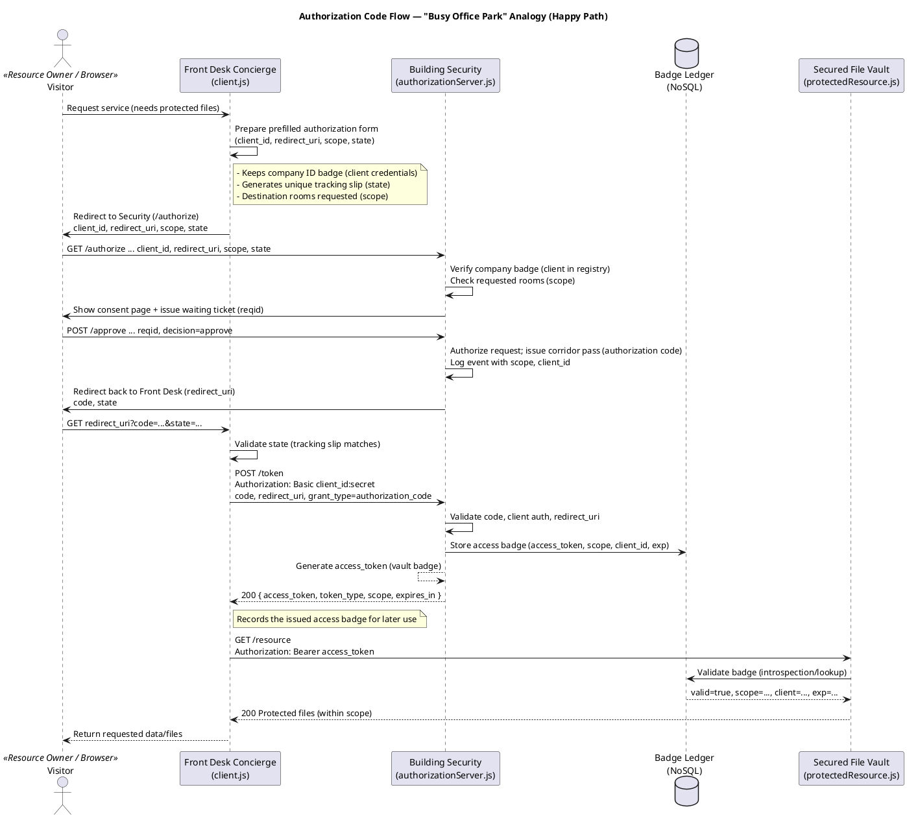

Here’s a **concise bullet-point summary** of the *“Busy Office Park”* analogy for OAuth 2.0 (from *OAuth in Action*, Ch. 3):

---

### 🏢 **Overall Analogy**

* The OAuth ecosystem is visualized as **an office park** with three main suites:

  * **Front Desk Concierge** → `client.js` (OAuth Client)
  * **Building Security** → `authorizationServer.js` (Authorization Server)
  * **Secured File Vault** → `protectedResource.js` (Resource Server)
* **Visitor** → Resource Owner (user) moving between these offices.
* The offices cooperate to **issue, validate, and honor access badges** (tokens).

---

### 👩‍💼 **Client.js → Front Desk Concierge**

* Holds **company’s ID badge** → *client credentials* (`client_id`, `secret`).
* Gives visitor a **prefilled form** → *authorization request* with `state`.
* Sends visitor to **security desk** → *redirect to /authorize*.
* When visitor returns:

  * Checks the **tracking slip** → verifies `state`.
  * Trades **corridor pass** → *authorization code* for a **vault badge** → *access token* at `/token`.
* Later uses that **badge** to fetch files from the vault → *API request with access_token*.
* If badge fails → logs and restarts the flow.

---

### 🛡️ **AuthorizationServer.js → Building Security**

* Keeps the **tenant registry** → list of clients and allowed **scopes**.
* `/authorize`: checks **company badge** (client credentials) & **requested rooms** (scope).
  Issues a **waiting-room ticket** → `reqid`.
* `/approve`: once visitor signs consent, issues a **corridor pass** → *authorization code*.
* `/token`: trades that **corridor pass** + company ID for **vault badge** → *access token*.
* Stores badge in **ledger (NoSQL)** for guards to validate later.

---

### 🔒 **ProtectedResource.js → Secured File Vault**

* Guards (middleware) check every request:

  * Accept **badge** via `Authorization: Bearer ...`
  * Verify against **ledger** → confirm badge validity and scope.
* If valid → open vault; else → reject with `401/403`.

---

### 🧾 **Concept Mapping Highlights**

| Analogy Item        | OAuth Concept                  | Description                             |
| ------------------- | ------------------------------ | --------------------------------------- |
| Company ID Badge    | Client Credentials             | Authenticates the app at `/token`       |
| Tracking Slip       | State                          | Protects against CSRF; verifies return  |
| Waiting-Room Ticket | ReqID                          | Links consent to authorization request  |
| Corridor Pass       | Authorization Code             | Short-lived code to exchange for token  |
| Vault Badge         | Access Token                   | Proof of access for protected resources |
| Badge Ledger        | Token Store / Introspection DB | Validates issued tokens                 |
| Rooms / Areas       | Scopes                         | Limits what resources can be accessed   |

---

### ⚙️ **Flow Snapshot**

1. Visitor → Front Desk → Security (authorization request).
2. Security verifies and issues **corridor pass**.
3. Front Desk redeems it for **vault badge**.
4. Uses badge at the **Vault** to retrieve files.
5. Guards validate badge via **ledger**.
6. If invalid → Front Desk re-starts flow.

---

**✨ Key takeaway:**

> OAuth’s actors interact like an office park:
> the *Client* coordinates, *Authorization Server* enforces, and *Resource Server* protects—
> with tokens serving as **security badges** connecting trust across all doors.