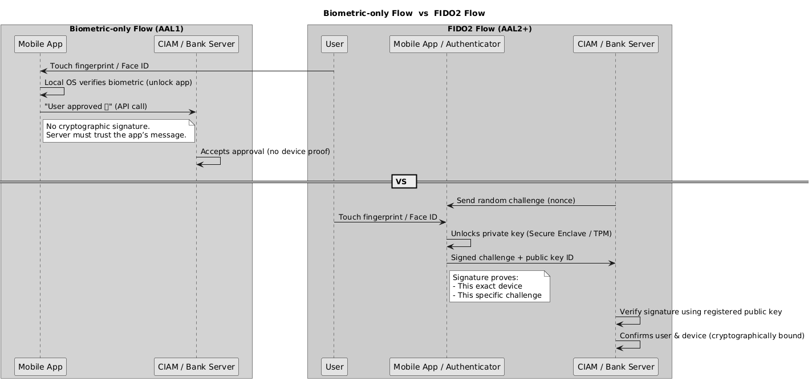

Excellent question — and one that trips up even experienced architects.
Let’s break it down very clearly and in **plain language**, using analogies and real examples.

---

## 🧩 1️⃣ “Proof of possession” — what it actually means

In security standards (like **NIST SP 800-63B**, **FIDO2**, or **APRA CPG 234’s intent**),
**proof of possession** means:

> *You can prove to the server that you physically hold a specific, trusted device — not just that you touched it.*

And the only reliable way to *prove* that digitally is for your device to use a **cryptographic key** (private key) that:

* Is **stored securely on the device**, and
* Can **sign a unique challenge** that only that device can produce, and
* The server can **verify using the matching public key**.

That’s what “cryptographically bound” means — the server can mathematically verify *this exact phone* approved *this exact request*.

---

## 🧠 2️⃣ Why biometrics alone don’t provide that proof

Biometrics — like Face ID, fingerprint, voice, or face scan — prove **who** is physically touching the phone,
but they don’t prove **which device** generated the approval.

Let’s look at the difference:

| Attribute                                   | Biometric check                                               | Cryptographic proof                                                 |
| ------------------------------------------- | ------------------------------------------------------------- | ------------------------------------------------------------------- |
| What it proves                              | “A real person who matches this face/fingerprint is present.” | “This specific phone (with this private key) signed the challenge.” |
| Where verification happens                  | Locally on device (via OS APIs).                              | Server-side (using registered public key).                          |
| What the server sees                        | A flag: “Biometric succeeded.”                                | A signed, verifiable message from a unique device key.              |
| Can the server tell if it’s the same phone? | ❌ No — server just trusts the app’s API call.                 | ✅ Yes — each device key is unique and verifiable.                   |

So even if a biometric is required, the mobile app still just sends an API call saying

> “User approved ✅”

—but that message could, in theory, be replayed or faked if an attacker compromises the app, because there’s **no cryptographic signature** binding that approval to the physical device.

---

## 🔒 3️⃣ Real-world analogy

Imagine you’re approving a bank login:

* **Biometric-only:** You call the bank and say “It’s me, I swear!” The bank hears your voice but can’t be 100% sure it’s from your registered phone.
* **Cryptographic binding:** Your phone signs a digital document with its unique, registered key — like stamping it with an official seal only your phone can produce.

That’s the gap between “user presence” (biometric) and “device possession proof” (crypto key).

---

## 🧩 4️⃣ Why standards treat them separately

* **Biometric = “inherence factor”**
  Verifies that *a person* is there and matches enrollment.
* **Cryptographic key = “possession factor”**
  Proves that *this registered device* is participating.

NIST SP 800-63B explicitly says:

> *“Biometric authentication SHALL be used only as a verifier unlock mechanism for a memorized secret or a physical authenticator.”*
> → Meaning: biometrics **unlock** the proof-of-possession key, they’re not the proof themselves.

That’s exactly how **FIDO2/WebAuthn** works:

* Fingerprint → unlocks device’s private key → device signs challenge → server verifies signature.

---

## 🧭 5️⃣ How this applies to your flow

In your current design:

* The mobile app checks biometric → confirms user presence.
* But the app doesn’t use a cryptographic key to sign the challenge → the server can’t mathematically verify that the approval came from that specific device.
* Therefore: biometric ≠ proof of possession. It’s only **proof of user presence** on an unverified device.

---

## ✅ 6️⃣ Plain summary

| Concept                        | Plain explanation                                                                                      |
| ------------------------------ | ------------------------------------------------------------------------------------------------------ |
| **Biometric check**            | Says: “The right person is using *a* phone right now.”                                                 |
| **Cryptographic binding**      | Says: “This specific registered phone produced this approval.”                                         |
| **Together (FIDO2)**           | The phone proves both *who you are* and *which device you’re using*.                                   |
| **Biometric-only (your flow)** | Good for UX and “user presence,” but the server still trusts the app’s word — not cryptographic proof. |

---

So:

> **Biometrics confirm the human; cryptography confirms the hardware.**
> Without the latter, the system can’t prove that “this specific registered device” sent the approval — which is why biometric re-auth alone is not considered *proof of possession*.